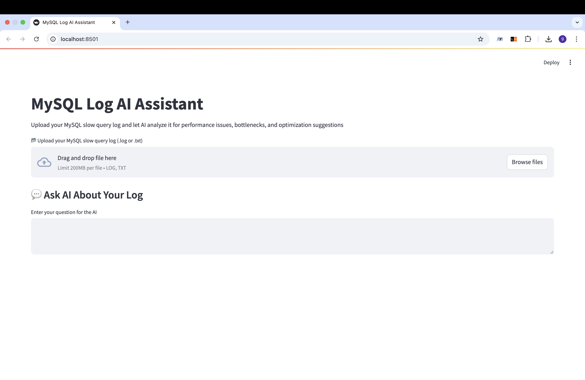
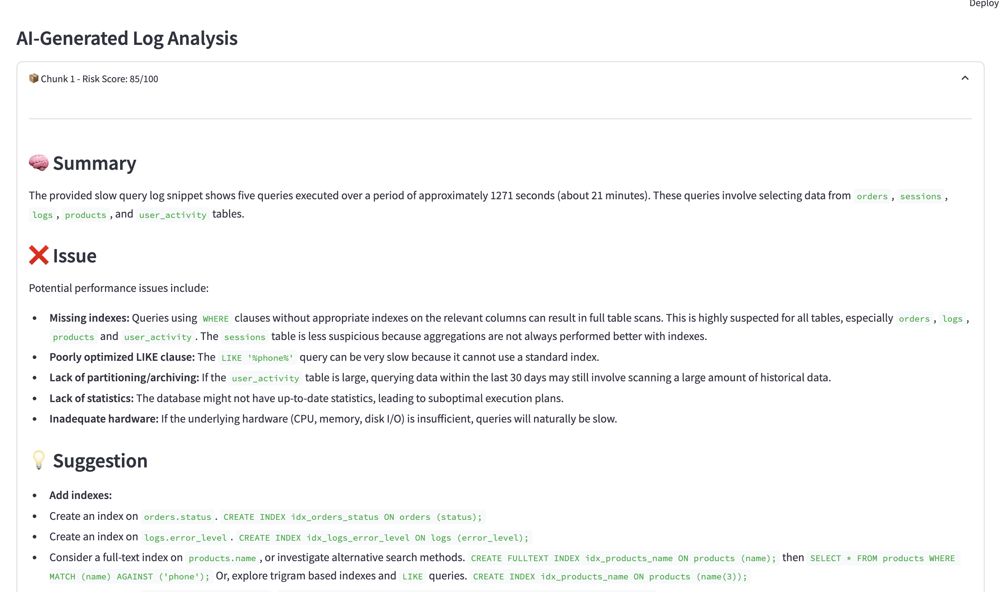
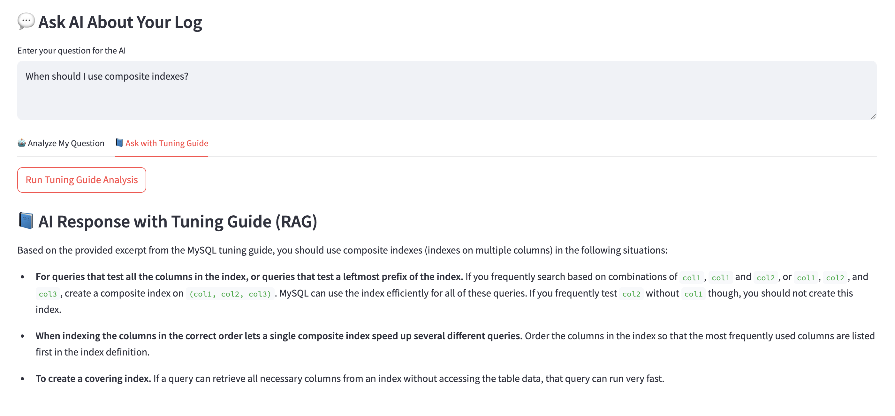

# 🧠 MySQL Log AI Assistant

An AI-powered assistant for analyzing MySQL slow query logs.

This tool uses Gemini LLM to identify performance issues, summarize query behavior, and suggest SQL optimizations.  
It also leverages Retrieval-Augmented Generation (RAG) to provide expert-level answers based on the official MySQL 8.4 Tuning Guide.

---

## 🎯 Why I Built This

I wanted to demonstrate how generative AI can be applied to real-world backend problems — not just for chatbots,  
but for meaningful tasks like diagnosing and optimizing SQL query performance.  
By combining large language models (LLMs) with RAG techniques and official documentation,  
this project showcases how AI can be turned into a practical, developer-friendly assistant.

It reflects my interest in building tools that bridge AI capabilities with real backend workflows.

---

## 🚀 Features

- 📂 Upload `.log` or `.txt` MySQL slow query logs
- 🧠 Chunk-based Gemini analysis: summary, issues, suggestions, and SQL recommendations
- 💬 Ask custom questions about your log using the LLM
- 📘 Ask expert-level tuning questions using RAG and the MySQL 8.4 Tuning Guide

---

## 📸 Demo


> Example question: `What does type: ALL mean in EXPLAIN output?`

---

## 📸 Screenshots

| Log Upload | AI Analysis Result | RAG Answer |
|------------|--------------------|------------|
|  |  |  |


___

## 🛠️ Getting Started

### 1. Clone the repository

```bash
git clone https://github.com/giyeon-dev/mysql-log-ai-assistant.git
cd mysql-log-ai-assistant
```

### 2. Set up a virtual environment

```bash
python -m venv venv
source venv/bin/activate  # On Windows: venv\Scripts\activate
```

### 3. Install dependencies

```bash
pip install -r requirements.txt
```

### 4. Add your Gemini API key

Create a `.env` file in the root directory:

```env
GEMINI_API_KEY=your-gemini-api-key
```

Refer to `.env.example` for structure.

---

## 🧪 Usage

### 🔍 Option 1: Run the Streamlit app

```bash
streamlit run app.py
```

1. Upload a slow query log file
2. View chunk-based analysis with AI insights
3. Ask your own question (custom prompt)
4. Get expert answers based on the tuning guide (RAG)

### 🔍 Option 2: Test RAG in terminal

```bash
python rag/rag_ask.py
```

---

## 🧠 Example Prompts

```text
What does type: ALL mean in EXPLAIN output?
How can I optimize queries using LIKE '%keyword%'?
When should I use composite indexes?
```

---

## 📁 Project Structure

```
mysql-log-ai-assistant/
├── app.py
├── log_parser.py
├── llm.py
├── requirements.txt
├── .env.example
├── rag/
│   ├── pdf_to_text.py
│   ├── rag_loader.py
│   ├── rag_ask.py
│   └── MYSQL8.4_tuning_guide.txt
└── screenshots/
    └── demo.gif
```

---

## 🛡️ Security Notes

- `.env` is excluded via `.gitignore`
- API keys are never committed — use `.env.example` for reference


---

## 🙋‍♂️ Author

Made with ❤️ by [giyeon-dev](https://github.com/giyeon-dev)
